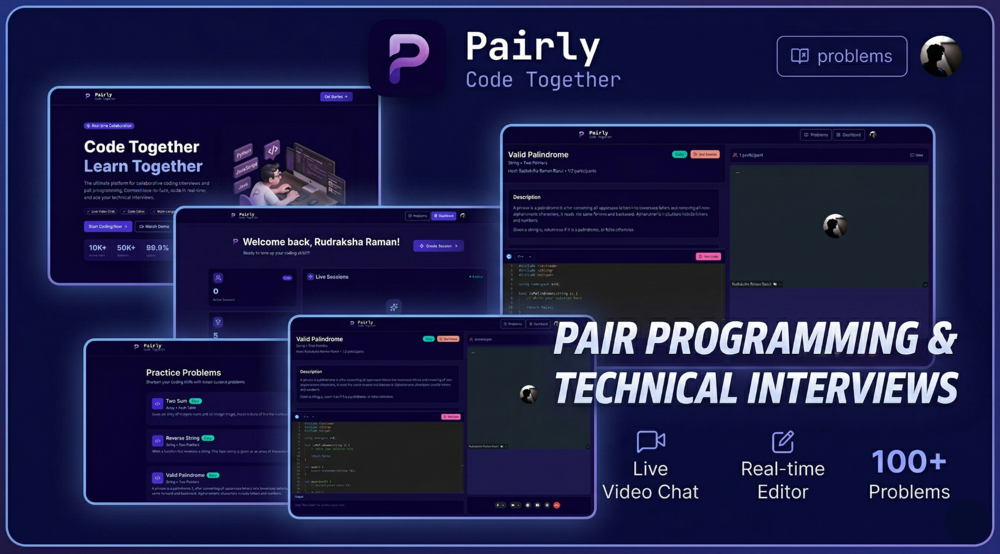

# Pairly

A full-stack peer-to-peer interview platform that enables real-time technical interviews with video calling, live code collaboration, and instant code execution. Perfect for conducting technical interviews, coding assessments, and pair programming sessions.

## Features

- **Real-Time Video Calls**: Built-in video conferencing for conducting interviews
- **Live Chat**: Integrated messaging system during interviews
- **Code Editor**: Monaco-based code editor with syntax highlighting and multi-language support
- **Code Submission & Execution**: Execute and test code on-the-fly with built-in compiler support
- **Problem Library**: Curated collection of technical problems with multiple difficulty levels
- **Session Management**: Create and manage interview sessions with active tracking
- **User Authentication**: Secure authentication using Clerk
- **Responsive UI**: Modern, responsive interface built with React and Tailwind CSS

## Tech Stack

### Frontend

- **React 19** - UI framework
- **Vite** - Build tool and dev server
- **Tailwind CSS** - Utility-first CSS framework
- **DaisyUI** - Component library built on Tailwind
- **Monaco Editor** - Feature-rich code editor
- **Stream Chat React** - Real-time chat integration
- **Stream Video React SDK** - Video calling
- **Clerk React** - Authentication
- **React Router** - Client-side routing
- **Axios** - HTTP client
- **React Query** - Server state management
- **React Hot Toast** - Notifications
- **React Resizable Panels** - Resizable panel layouts

### Backend

- **Node.js** - JavaScript runtime
- **Express 5** - Web framework
- **MongoDB & Mongoose** - Database
- **Clerk Express** - Authentication middleware
- **Stream SDK** - Chat and video infrastructure
- **Inngest** - Event processing and background jobs
- **CORS** - Cross-origin resource sharing
- **Dotenv** - Environment variable management

## Project Structure

```
Pairly/
├── backend/
│   ├── src/
│   │   ├── server.js                 # Express server entry point
│   │   ├── controllers/              # Request handlers
│   │   │   ├── chatController.js     # Chat functionality
│   │   │   ├── codeSubmit.js         # Code execution
│   │   │   └── sessionController.js  # Session management
│   │   ├── routes/                   # API routes
│   │   │   ├── chatRoute.js
│   │   │   ├── sessionRoute.js
│   │   │   └── submitRoute.js
│   │   ├── models/                   # Mongoose schemas
│   │   │   ├── User.js
│   │   │   └── Session.js
│   │   ├── lib/                      # Utility modules
│   │   │   ├── db.js                 # Database connection
│   │   │   ├── env.js                # Environment variables
│   │   │   ├── inngest.js            # Background jobs
│   │   │   └── stream.js             # Stream SDK initialization
│   │   └── middleware/               # Express middleware
│   │       └── protectRoute.js       # Authentication middleware
│   └── package.json
│
├── frontend/
│   ├── src/
│   │   ├── App.jsx                  # Main app component
│   │   ├── main.jsx                 # React DOM entry point
│   │   ├── pages/                   # Page components
│   │   │   ├── HomePage.jsx         # Landing page
│   │   │   ├── Dashboard.jsx        # User dashboard
│   │   │   ├── Problems.jsx         # Problems listing
│   │   │   ├── ProblemPage.jsx      # Problem details
│   │   │   └── SessionPage.jsx      # Active interview session
│   │   ├── components/              # Reusable components
│   │   │   ├── CodeEditorPanel.jsx
│   │   │   ├── OutputPanel.jsx
│   │   │   ├── VideoCallUI.jsx
│   │   │   ├── CreateSessionsModal.jsx
│   │   │   ├── Navbar.jsx
│   │   │   └── ...
│   │   ├── hooks/                   # Custom React hooks
│   │   │   ├── useSessions.js
│   │   │   ├── useStreamClient.js
│   │   │   └── ...
│   │   ├── api/                     # API client functions
│   │   │   └── sessions.js
│   │   ├── lib/                     # Utility functions
│   │   │   ├── axios.js             # Axios configuration
│   │   │   ├── stream.js            # Stream SDK setup
│   │   │   ├── submit.js            # Code submission logic
│   │   │   └── utils.js
│   │   ├── data/                    # Static data
│   │   │   └── problems.js          # Problem definitions
│   │   └── index.css
│   ├── vite.config.js
│   ├── eslint.config.js
│   ├── package.json
│   └── index.html
│
└── package.json                    # Root package.json
```

## Prerequisites

Before you begin, ensure you have installed:

- **Node.js** (v16 or higher)
- **npm** (v8 or higher)
- **MongoDB** (local or MongoDB Atlas cloud)

## Installation

### 1. Clone the Repository

```bash
git clone <repository-url>
cd pairly
```

### 2. Install Root Dependencies

```bash
npm install
```

### 3. Install Backend Dependencies

```bash
npm install --prefix backend
```

### 4. Install Frontend Dependencies

```bash
npm install --prefix frontend
```

## Environment Variables

### Backend Setup

Create a `.env` file in the `backend` directory with the following variables:

```env
# Server
PORT=5000
NODE_ENV=development

# Database
DB_URL=mongodb://localhost:27017/pairly
# Or for MongoDB Atlas:
# DB_URL=mongodb+srv://<username>:<password>@<cluster-name>.mongodb.net/pairly

# Client URL (for CORS)
CLIENT_URL=http://localhost:5173

# Clerk Authentication
CLERK_PUBLISHABLE_KEY=your_clerk_publishable_key
CLERK_SECRET_KEY=your_clerk_secret_key

# Stream SDK
STREAM_API_KEY=your_stream_api_key
STREAM_API_SECRET=your_stream_api_secret

# Inngest (Background Jobs)
INNGEST_EVENT_KEY=your_inngest_event_key
INNGEST_SIGNING_KEY=your_inngest_signing_key
```

### Frontend Setup

Create a `.env` file in the `frontend` directory:

```env
VITE_CLERK_PUBLISHABLE_KEY=your_clerk_publishable_key
VITE_API_URL=http://localhost:5000
```

## Getting Started

### Development Mode

#### Terminal 1 - Backend Server

```bash
cd backend
npm run dev
```

The backend server will run on `http://localhost:5000`

#### Terminal 2 - Frontend Development Server

```bash
cd frontend
npm run dev
```

The frontend will run on `http://localhost:5173`

### Production Build

```bash
npm run build
```

### Start Production Server

```bash
npm start
```

## API Endpoints

### Chat Endpoints

- `GET /api/chat/token` - Get Stream chat token for authentication

### Session Endpoints

- `POST /api/sessions/create` - Create a new interview session
- `GET /api/sessions/active` - Get all active sessions
- `GET /api/sessions/recent` - Get recent completed sessions

### Code Submission Endpoints

- `POST /api/run` - Submit and execute code

## Database Schema

### User Model

```javascript
{
  clerkId: String (unique),
  name: String,
  email: String,
  image: String,
  profileImage: String,
  createdAt: Date
}
```

### Session Model

```javascript
{
  problem: String,
  difficulty: String,
  host: ObjectId (reference to User),
  participant: ObjectId (reference to User),
  status: String (active/completed),
  callId: String,
  createdAt: Date,
  updatedAt: Date
}
```

## Key Features Explained

### Real-Time Video Calls

The platform uses Stream SDK for peer-to-peer video calls. Sessions are created with unique call IDs and support multiple participants.

### Code Execution

Leverages the OnlineCompiler API to execute code in multiple languages including Python, C++, Java, JavaScript, and more.

### Chat System

Integrated Stream Chat allows interviewers and candidates to communicate in real-time during sessions.

### Problem Bank

Pre-defined problem set with difficulty levels (Easy, Medium, Hard) and multiple coding languages support.

## Development Workflow

### Adding New Problems

Edit `frontend/src/data/problems.js` to add new coding problems with:

- Problem description
- Constraints
- Examples
- Starter code templates for multiple languages

### Creating New API Routes

1. Create controller in `backend/src/controllers/`
2. Create route file in `backend/src/routes/`
3. Import and use route in `backend/src/server.js`

### Adding React Components

1. Create component in `frontend/src/components/`
2. Import and use in pages or other components

## Scripts

### Root Level

```bash
npm run build       # Build entire project
npm start           # Start production server
```

### Backend

```bash
npm run dev         # Start with nodemon for development
npm start           # Start production server
```

### Frontend

```bash
npm run dev         # Start Vite dev server
npm run build       # Build for production
npm run lint        # Run ESLint
npm run preview     # Preview production build
```

## Authentication

The application uses Clerk for authentication. Users need to:

1. Sign up/Sign in via Clerk
2. Clerk provides JWT tokens
3. Backend validates tokens using Clerk middleware
4. Protected routes check authentication status

## External Services

### Stream

- **Purpose**: Real-time chat and video calling
- **Docs**: https://getstream.io/

### Clerk

- **Purpose**: User authentication and management
- **Docs**: https://clerk.com/

### OnlineCompiler API

- **Purpose**: Code execution and testing
- **API**: https://api.onlinecompiler.io/

### Inngest

- **Purpose**: Background job processing and event handling
- **Docs**: https://www.inngest.com/

## Support

For issues, questions, or suggestions, please open an issue in the repository or contact me.

---

**Happy conducting interviews! 🚀**
